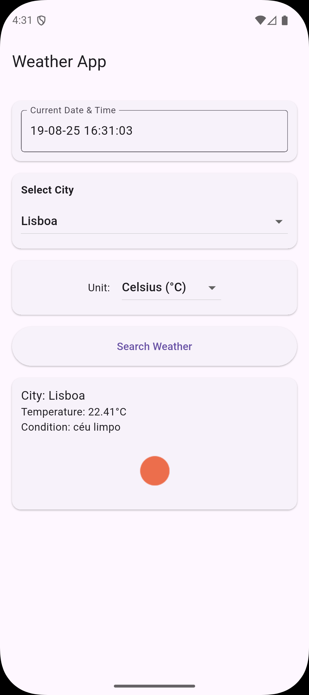

# 🌤️ Weather App

A Flutter application that displays the **current date, time, and weather information** for a selected city. Users can choose the temperature unit (Celsius or Fahrenheit) and fetch real-time weather data using an API.

---

## 🚀 Features

- Live **current date and time** display.
- Select a **city** from a dropdown.
- Choose **temperature unit**: Celsius (°C) or Fahrenheit (°F).
- Shows **weather conditions** with an icon.
- Clean and responsive **UI** built with Flutter.

---

## 🛠️ Technologies

- **Flutter**: For building cross-platform UI.
- **Dart**: Programming language.
- **HTTP**: API calls for weather data.

---

## 🖼️ Screenshots

*Main screen with current date and weather options.*

*Weather info displayed after selecting a city.*

---
